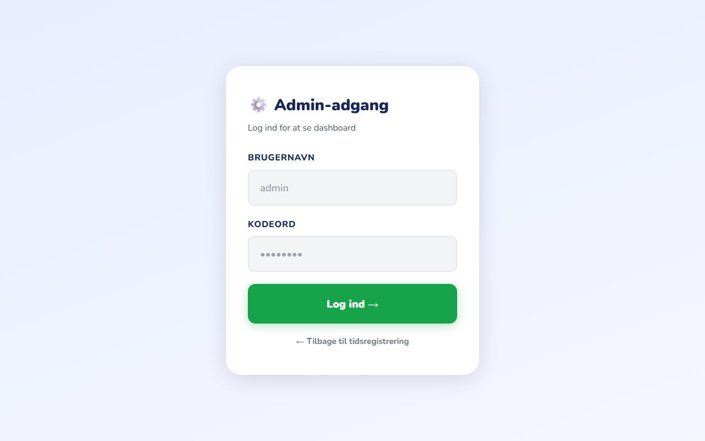
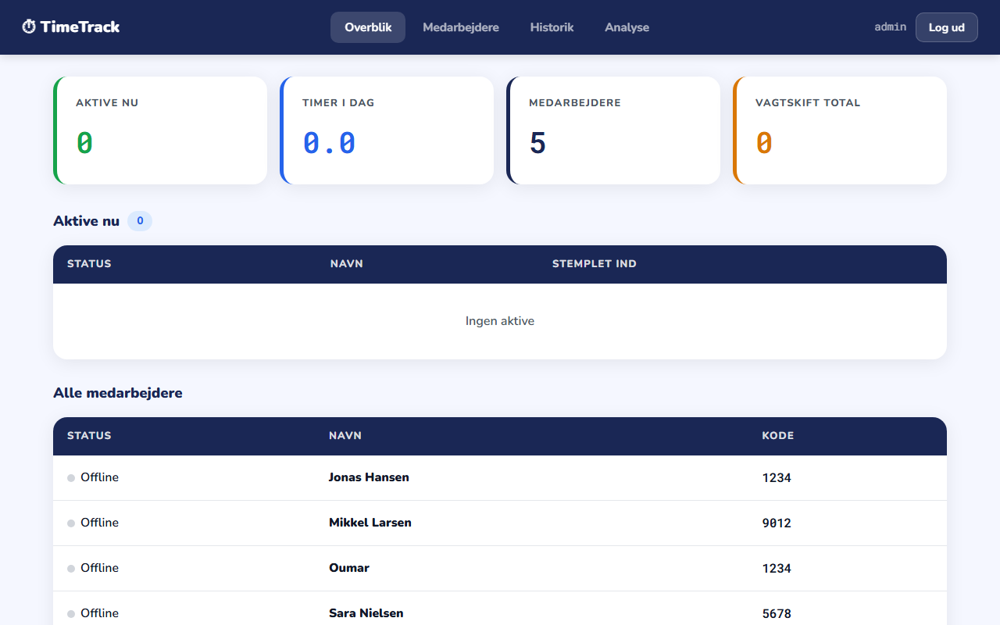
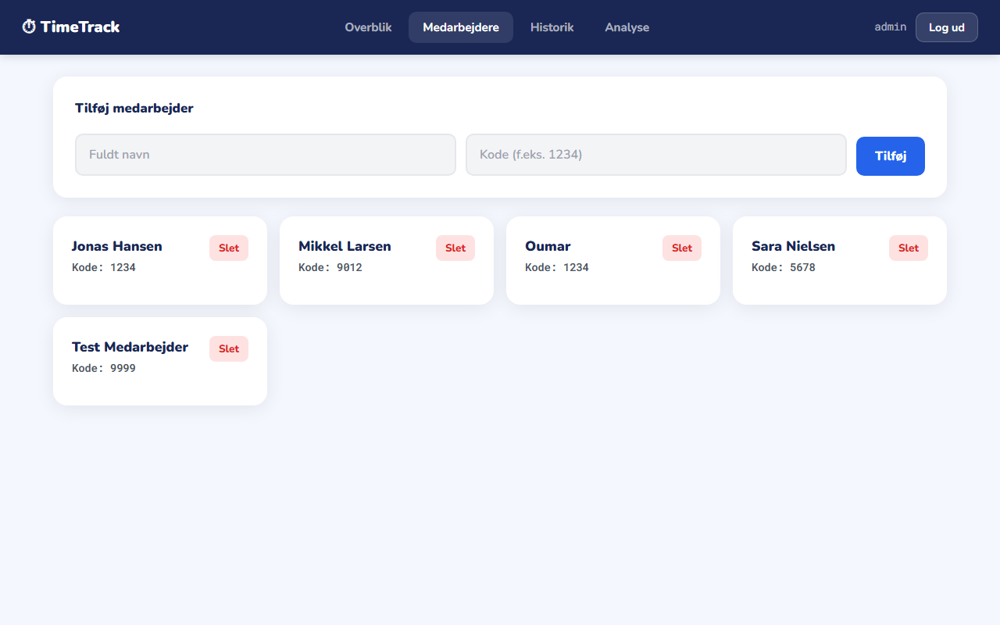
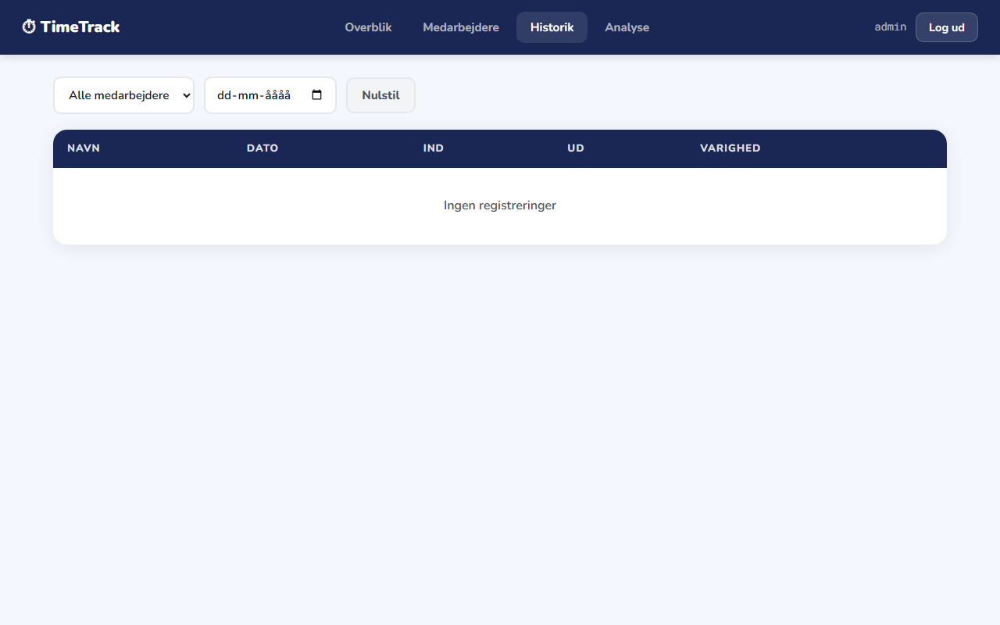
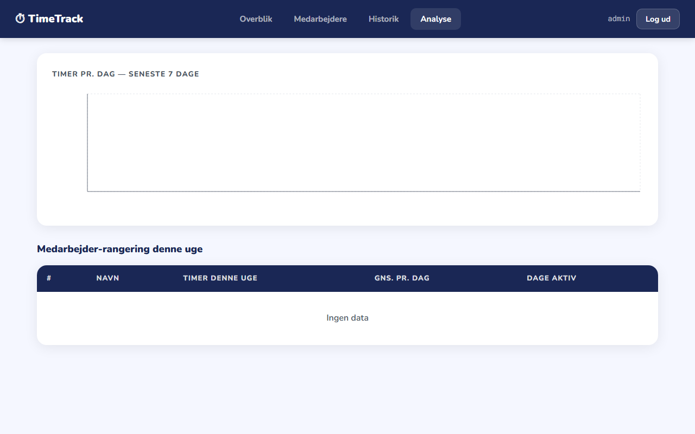

# TimeTrack Pro

Tidsregistreringssystem bygget med React + Node/Express + PostgreSQL (MVC arkitektur).  
Designet til at være nemt at bruge — også for ældre medarbejdere: stor tekst, klare knapper og høj kontrast.

## Skærmbilleder

### Stemme ind / ud
Medarbejderen skriver sit navn og personlige kode for at stemme ind eller ud. Uret viser den aktuelle tid, og knappen skifter automatisk fra grøn (ind) til rød (ud).


---

### Admin login
Lederen logger ind med brugernavn og kodeord for at få adgang til dashboardet.



---

### Dashboard — Overblik
Viser nøgletal øverst (aktive nu, timer i dag, antal medarbejdere, vagtskift), aktive medarbejdere med ind-tidspunkt, og en oversigt over alle medarbejdere.



---

### Dashboard — Medarbejdere
Admin kan tilføje nye medarbejdere (navn + kode) og se alle eksisterende med deres status. Slet-knap på hvert kort.



---

### Dashboard — Historik
Komplet log over alle vagtskift med filtrering på medarbejder og dato. Viser ind-tid, ud-tid og samlet arbejdstid.



---

### Dashboard — Analyse
Søjlediagram over timer pr. dag de seneste 7 dage, samt medarbejder-rangering for ugen med gennemsnitlig daglig arbejdstid.



---

## Stack
- **Frontend**: React, React Router, Recharts, Axios
- **Backend**: Node.js, Express, JWT auth
- **Database**: PostgreSQL
- **Auth**: JWT tokens (admin), navn+kode (medarbejdere)

## Kom i gang

### 1. Klon repo
```bash
git clone https://github.com/oumar969/timetrack-pro.git
cd timetrack-pro
```

### 2. Start database (PostgreSQL)
```bash
docker-compose up db -d
```

### 3. Backend
```bash
cd backend
cp .env.example .env   # ret DATABASE_URL og JWT_SECRET
npm install
node src/config/migrate.js   # opret tabeller + seed data
npm run dev
```

### 4. Frontend
```bash
cd frontend
npm install
npm start
```

Åbn http://localhost:3000

## API Endpoints

| Method | Route | Beskrivelse | Auth |
|--------|-------|-------------|------|
| POST | /api/auth/login | Admin login → JWT | Nej |
| POST | /api/clock/in | Medarbejder stemmer ind | Nej |
| POST | /api/clock/out | Medarbejder stemmer ud | Nej |
| GET | /api/employees | Alle medarbejdere | JWT |
| POST | /api/employees | Opret medarbejder | JWT |
| DELETE | /api/employees/:id | Slet medarbejder | JWT |
| GET | /api/sessions | Historik | JWT |
| GET | /api/analytics/week | Ugentlig analyse | JWT |

## Default login
- **Admin:** `admin` / `admin123`
- **Demo medarbejdere:** Jonas Hansen (1234), Sara Nielsen (5678), Mikkel Larsen (9012)
